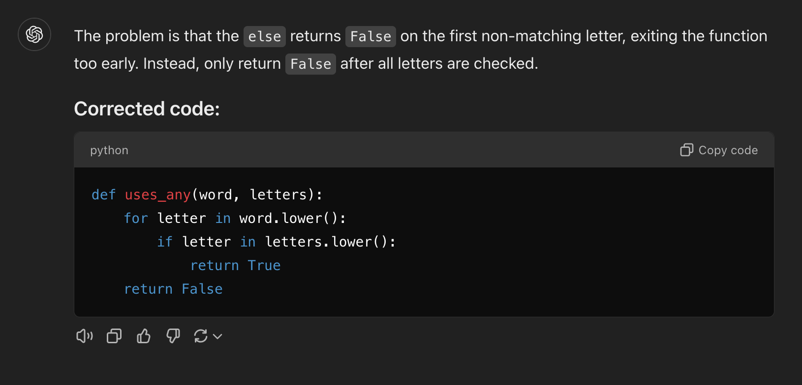

# Can the AI Bot Tell Me What's Wrong?

```python
# This is relatively correct
def uses_any(word, letters):
    for letter in word.lower():
        if letter in letters.lower():
            return True
    return False
```

```python
# But this is not, what does the AI Bot think?
def uses_any_incorrect(word, letters):
    for letter in word.lower():
        if letter in letters.lower():
            return True
        else:
            return False     # INCORRECT!
```

